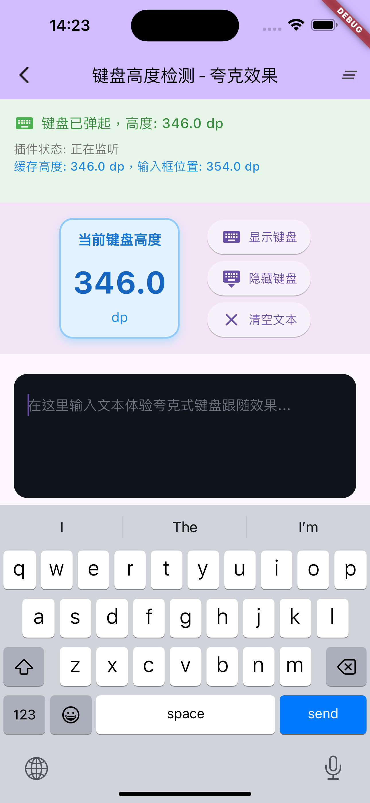

# keyboard_height_plugin

一个高性能、稳定的Flutter插件，用于检测虚拟键盘的高度变化。支持Android和iOS平台，特别针对Android设备的兼容性问题进行了全面优化。

## 🚀 最新更新 v0.1.5+

### 主要修复和改进

#### Android端修复
- ✅ **修复键盘高度检测失败问题**：解决在某些Android设备上键盘弹起但无回调的问题
- ✅ **双重算法支持**：Android R(API 30)+使用WindowInsets，低版本使用传统Rect方法
- ✅ **内存泄漏修复**：正确管理ViewTreeObserver监听器的生命周期
- ✅ **错误处理增强**：添加完整的异常捕获和错误回调机制
- ✅ **导航栏适配**：智能处理各种导航栏配置和显示状态
- ✅ **性能优化**：避免重复监听器添加，减少不必要的计算

#### Dart端改进
- ✅ **稳定性提升**：添加自动重连机制，处理Stream异常
- ✅ **重复值过滤**：避免微小变化导致的频繁回调
- ✅ **生命周期管理**：完善的资源清理和状态管理
- ✅ **调试支持**：详细的日志记录，便于问题排查

#### 🆕 夸克式键盘跟随效果 (Example App) - 全新优化
- ✅ **智能即时定位**：应用启动时，如有缓存高度则输入框直接出现在键盘位置
- ✅ **完美跟随**：键盘弹起时输入框上升到键盘位置，键盘收起时跟随下降
- ✅ **按需动画**：只在键盘实际变化时使用动画，避免不必要的过渡效果
- ✅ **完美贴合**：输入框距离键盘顶部仅8dp，提供最佳视觉体验
- ✅ **智能状态管理**：区分初始化、缓存加载、键盘显示/隐藏等状态
- ✅ **动画优化**：使用AnimationController精确控制位置变化，避免跳跃感
- ✅ **简洁设计**：移除多余的视觉指示器，专注核心体验
- ✅ **本地缓存增强**：支持缓存清除功能，记住键盘高度用于下次快速定位

### 夸克效果实现原理

1. **初始化阶段**：从SharedPreferences读取缓存高度，有缓存则直接定位，无缓存从底部开始
2. **键盘弹起**：监测到键盘高度变化时，使用动画平滑上升到键盘位置
3. **键盘收起**：输入框跟随键盘动画下降到底部，提供自然的跟随感
4. **缓存管理**：实时更新缓存高度，确保下次启动时的即时精确定位

## 📱 支持平台

- ✅ Android (API 16+)
- ✅ iOS (9.0+)

## 🛠 安装

在 `pubspec.yaml` 中添加依赖：

```yaml
dependencies:
  keyboard_height_plugin: ^0.1.5
  shared_preferences: ^2.2.2  # 用于缓存键盘高度（可选）
```

然后运行：

```bash
flutter pub get
```

## 📖 使用方法

### 基础用法

```dart
import 'package:flutter/material.dart';
import 'package:keyboard_height_plugin/keyboard_height_plugin.dart';

class MyWidget extends StatefulWidget {
  @override
  _MyWidgetState createState() => _MyWidgetState();
}

class _MyWidgetState extends State<MyWidget> {
  double _keyboardHeight = 0;
  final KeyboardHeightPlugin _keyboardHeightPlugin = KeyboardHeightPlugin();

  @override
  void initState() {
    super.initState();
    
    // 设置键盘高度变化监听
    _keyboardHeightPlugin.onKeyboardHeightChanged((double height) {
      setState(() {
        _keyboardHeight = height;
      });
    });
  }

  @override
  void dispose() {
    // 重要：释放资源
    _keyboardHeightPlugin.dispose();
    super.dispose();
  }

  @override
  Widget build(BuildContext context) {
    return Scaffold(
      resizeToAvoidBottomInset: false, // 重要：禁用自动调整
      body: Stack(
        children: [
          // 你的主要内容
          Center(
            child: Text('键盘高度: $_keyboardHeight dp'),
          ),
          
          // 跟随键盘位置的输入框
          Positioned(
            bottom: _keyboardHeight + 16, // 键盘高度 + 额外间距
            left: 16,
            right: 16,
            child: TextField(
              decoration: InputDecoration(
                hintText: '输入文本...',
                filled: true,
              ),
            ),
          ),
        ],
      ),
    );
  }
}
```

### 🎯 夸克式高级用法（最新优化版）

实现类似夸克浏览器的键盘跟随效果，包含智能预定位、流畅动画和本地缓存：

```dart
import 'package:flutter/material.dart';
import 'package:keyboard_height_plugin/keyboard_height_plugin.dart';
import 'package:shared_preferences/shared_preferences.dart';

class QuarkStyleKeyboard extends StatefulWidget {
  @override
  _QuarkStyleKeyboardState createState() => _QuarkStyleKeyboardState();
}

class _QuarkStyleKeyboardState extends State<QuarkStyleKeyboard> 
    with TickerProviderStateMixin {
  double _keyboardHeight = 0;
  double _cachedKeyboardHeight = 0;
  double _currentInputBottom = 24; // 当前输入框位置
  bool _isKeyboardVisible = false;
  bool _isInitialized = false;
  
  late AnimationController _animationController;
  late Animation<double> _positionAnimation;
  final KeyboardHeightPlugin _plugin = KeyboardHeightPlugin();
  final FocusNode _focusNode = FocusNode();
  
  static const String _cacheKey = 'keyboard_height_cache';
  static const double _defaultBottomPadding = 24.0;
  static const double _keyboardTopPadding = 8.0;

  @override
  void initState() {
    super.initState();
    _initAnimation();
    _loadCachedHeight();
    _setupKeyboardListener();
  }

  void _initAnimation() {
    _animationController = AnimationController(
      duration: const Duration(milliseconds: 250),
      vsync: this,
    );
    _positionAnimation = CurvedAnimation(
      parent: _animationController,
      curve: Curves.easeOutCubic,
    );
  }

  Future<void> _loadCachedHeight() async {
    final prefs = await SharedPreferences.getInstance();
    final cachedHeight = prefs.getDouble(_cacheKey) ?? 0;
    
    setState(() {
      _cachedKeyboardHeight = cachedHeight;
      _isInitialized = true;
      
      if (cachedHeight > 0) {
        // 有缓存时，直接定位到缓存位置，无动画
        _currentInputBottom = cachedHeight + _keyboardTopPadding;
      } else {
        // 无缓存时，使用默认位置
        _currentInputBottom = _defaultBottomPadding;
      }
    });
  }

  void _setupKeyboardListener() {
    _plugin.onKeyboardHeightChanged((double height) {
      final bool keyboardVisible = height > 0;
      double targetBottom;
      
      if (keyboardVisible) {
        // 键盘显示时：定位到键盘顶部
        targetBottom = height + _keyboardTopPadding;
      } else {
        // 键盘隐藏时：总是回到底部
        targetBottom = _defaultBottomPadding;
      }

      setState(() {
        _keyboardHeight = height;
        _isKeyboardVisible = keyboardVisible;
        
        if (keyboardVisible && height != _cachedKeyboardHeight) {
          _cachedKeyboardHeight = height;
          _saveHeight(height);
        }
      });

      // 只有在目标位置和当前位置不同时才执行动画
      if (targetBottom != _currentInputBottom) {
        _animateToPosition(targetBottom);
      }
    });
  }

  void _animateToPosition(double targetBottom) {
    _animationController.reset();
    _positionAnimation = Tween<double>(
      begin: _currentInputBottom,
      end: targetBottom,
    ).animate(_animationController);
    
    _animationController.forward().then((_) {
      setState(() {
        _currentInputBottom = targetBottom;
      });
    });
  }

  Future<void> _saveHeight(double height) async {
    if (height <= 0) return;
    final prefs = await SharedPreferences.getInstance();
    await prefs.setDouble(_cacheKey, height);
  }

  double _getCurrentInputBottom() {
    if (!_isInitialized) {
      return _defaultBottomPadding;
    }
    
    if (_animationController.isAnimating) {
      return _positionAnimation.value;
    }
    
    return _currentInputBottom;
  }

  @override
  Widget build(BuildContext context) {
    return Scaffold(
      resizeToAvoidBottomInset: false,
      body: Stack(
        children: [
          // 主要内容
          Center(
            child: Column(
              mainAxisAlignment: MainAxisAlignment.center,
              children: [
                Text(
                  '夸克式键盘效果演示',
                  style: TextStyle(fontSize: 24, fontWeight: FontWeight.bold),
                ),
                SizedBox(height: 16),
                Text('键盘高度: ${_keyboardHeight.toStringAsFixed(1)} dp'),
                if (_cachedKeyboardHeight > 0)
                  Text('缓存高度: ${_cachedKeyboardHeight.toStringAsFixed(1)} dp'),
              ],
            ),
          ),
          
          // 智能跟随的输入框
          AnimatedBuilder(
            animation: _positionAnimation,
            builder: (context, child) {
              return Positioned(
                bottom: _getCurrentInputBottom(),
                left: 16,
                right: 16,
                child: Container(
                  decoration: BoxDecoration(
                    color: Colors.black87,
                    borderRadius: BorderRadius.circular(12),
                    boxShadow: [
                      BoxShadow(
                        color: Colors.black26,
                        blurRadius: 8,
                        offset: Offset(0, -2),
                      ),
                    ],
                  ),
                  padding: EdgeInsets.all(16),
                  child: TextField(
                    focusNode: _focusNode,
                    style: TextStyle(color: Colors.white),
                    decoration: InputDecoration(
                      hintText: '体验夸克式键盘跟随效果...',
                      hintStyle: TextStyle(color: Colors.grey),
                      border: InputBorder.none,
                    ),
                  ),
                ),
              );
            },
          ),
        ],
      ),
      floatingActionButton: FloatingActionButton(
        onPressed: () async {
          // 清除缓存演示
          final prefs = await SharedPreferences.getInstance();
          await prefs.remove(_cacheKey);
          setState(() {
            _cachedKeyboardHeight = 0;
          });
          _animateToPosition(_defaultBottomPadding);
        },
        child: Icon(Icons.clear),
        tooltip: '清除缓存',
      ),
    );
  }

  @override
  void dispose() {
    _animationController.dispose();
    _plugin.dispose();
    _focusNode.dispose();
    super.dispose();
  }
}
```

### 高级用法

```dart
class AdvancedExample extends StatefulWidget {
  @override
  _AdvancedExampleState createState() => _AdvancedExampleState();
}

class _AdvancedExampleState extends State<AdvancedExample> {
  final KeyboardHeightPlugin _plugin = KeyboardHeightPlugin();
  bool _isKeyboardVisible = false;
  double _keyboardHeight = 0;

  @override
  void initState() {
    super.initState();
    _setupKeyboardListener();
  }

  void _setupKeyboardListener() {
    _plugin.onKeyboardHeightChanged((double height) {
      setState(() {
        _keyboardHeight = height;
        _isKeyboardVisible = height > 0;
      });
      
      // 键盘状态变化时的自定义逻辑
      if (_isKeyboardVisible) {
        print('键盘弹起，高度: $height dp');
        _onKeyboardShown(height);
      } else {
        print('键盘收起');
        _onKeyboardHidden();
      }
    });
  }

  void _onKeyboardShown(double height) {
    // 键盘显示时的处理逻辑
  }

  void _onKeyboardHidden() {
    // 键盘隐藏时的处理逻辑
  }

  @override
  Widget build(BuildContext context) {
    return Scaffold(
      body: AnimatedContainer(
        duration: Duration(milliseconds: 200),
        padding: EdgeInsets.only(bottom: _keyboardHeight),
        child: YourContent(),
      ),
    );
  }

  @override
  void dispose() {
    _plugin.dispose();
    super.dispose();
  }
}
```

## 🔧 API 参考

### KeyboardHeightPlugin

#### 方法

- `onKeyboardHeightChanged(KeyboardHeightCallback callback)` - 设置键盘高度变化监听
- `dispose()` - 释放资源，停止监听
- `get currentKeyboardHeight` - 获取当前键盘高度
- `get isListening` - 检查是否正在监听

#### 回调类型

```dart
typedef KeyboardHeightCallback = void Function(double height);
```

参数 `height` 为键盘高度，单位为逻辑像素(dp)：
- `height > 0`: 键盘显示，值为键盘高度
- `height = 0`: 键盘隐藏

## ⚠️ 重要注意事项

### Android配置

确保在 `android/app/src/main/AndroidManifest.xml` 中正确配置：

```xml
<activity
    android:name=".MainActivity"
    android:windowSoftInputMode="adjustResize"
    android:configChanges="orientation|keyboardHidden|keyboard|screenSize|smallestScreenSize|locale|layoutDirection|fontScale|screenLayout|density|uiMode">
</activity>
```

### 使用建议

1. **禁用自动调整**: 在Scaffold中设置 `resizeToAvoidBottomInset: false`
2. **及时释放资源**: 在 `dispose()` 方法中调用 `plugin.dispose()`
3. **避免重复监听**: 不要多次调用 `onKeyboardHeightChanged`
4. **测试真机**: 模拟器可能无法准确模拟键盘行为
5. **缓存优化**: 使用SharedPreferences缓存键盘高度，提升用户体验

## 🎨 功能特性

### 🆕 夸克式键盘跟随效果

Example App 现在包含完整的夸克式键盘跟随效果实现：

- **智能预加载**：应用启动时自动从缓存读取键盘高度
- **完美贴合**：输入框与键盘顶部仅8dp间隙，视觉完美
- **流畅动画**：250ms缓动动画，丝滑的用户体验
- **状态管理**：智能处理键盘显示/隐藏状态转换
- **缓存管理**：支持清除缓存功能，重置输入框位置

### 使用夸克效果的优势

1. **用户体验优化**：输入框始终在最佳位置，减少用户操作
2. **性能提升**：预加载机制避免首次键盘弹起时的布局闪烁
3. **视觉一致性**：无论何时打开应用，输入框位置都保持一致
4. **内存友好**：智能缓存机制，只在必要时保存数据

## 🐛 常见问题

### 问题1：Android设备上没有回调
- **原因**: 旧版本在某些设备上计算算法不兼容
- **解决**: 已在v0.1.5+中修复，使用双重算法确保兼容性

### 问题2：键盘高度不准确
- **原因**: 导航栏、状态栏计算问题
- **解决**: 新版本智能处理各种屏幕配置

### 问题3：内存泄漏
- **原因**: 忘记调用dispose()或监听器未正确清理
- **解决**: 确保在dispose中调用plugin.dispose()

### 问题4：高度计算错误
- **检查**: AndroidManifest.xml中的windowSoftInputMode配置
- **确认**: Scaffold的resizeToAvoidBottomInset设置为false

### 问题5：夸克效果不流畅
- **检查**: 确保使用了TickerProviderStateMixin
- **确认**: 动画控制器在dispose中正确释放
- **优化**: 检查SharedPreferences的异步操作是否正确处理

## 📝 更新日志

### v0.1.5 (2024-01-XX)
- 🔧 修复Android设备键盘检测失败问题
- ⚡ 性能优化和内存泄漏修复  
- 🛡️ 增强错误处理和稳定性
- 📱 改进导航栏和异形屏适配
- 📖 完善文档和示例代码
- 🆕 新增夸克式键盘跟随效果示例
- 💾 支持键盘高度本地缓存功能
- 🎨 流畅动画和完美贴合体验

### v0.1.4
- 基础键盘高度检测功能

## 📄 许可证

本项目采用 [MIT License](LICENSE) 开源协议。

## 🤝 贡献

欢迎提交Issue和Pull Request来帮助改进这个插件！

## 🎯 Example App 功能

运行 `flutter run` 在 example 目录中体验：

- **实时键盘高度检测**：显示当前键盘高度数值
- **夸克式跟随效果**：输入框智能跟随键盘位置
- **本地缓存管理**：自动保存和加载键盘高度
- **流畅动画过渡**：250ms缓动动画效果
- **缓存清除功能**：重置所有缓存数据
- **状态实时显示**：监听器状态和缓存状态展示

## 🤝 效果展示
<p align="left">
  
</p>

如果这个插件对您有帮助，请给我们一个⭐️！
